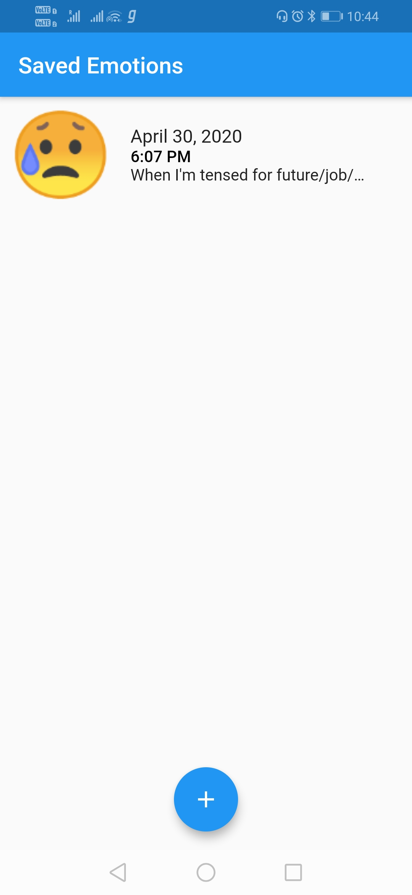
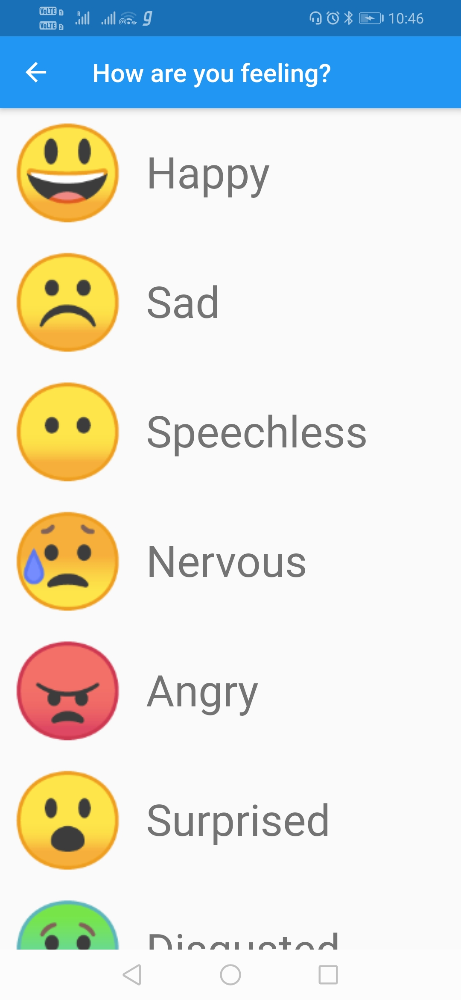

# emotion_app

A flutter app made using Redux based architecture.
Redux based architecture helps in managing the states effectively.
State generally contains the information that is used by various screens to render the loaded data.
Making the right architectural decisions simplify the layering of the application and make future changes less painful.
Redux is a unidirectional data flow architecture that makes it easy to develop,maintain and test applications.

It has different components such as Store,Action,Middleware,View and Reducer.

Flutter packages available for redux architecture are - 
1 redux
2 flutter_redux

The app is a basic app in which the person can save the emotions they felt throughout the day.

 

Technology Stack 

=> Dart
